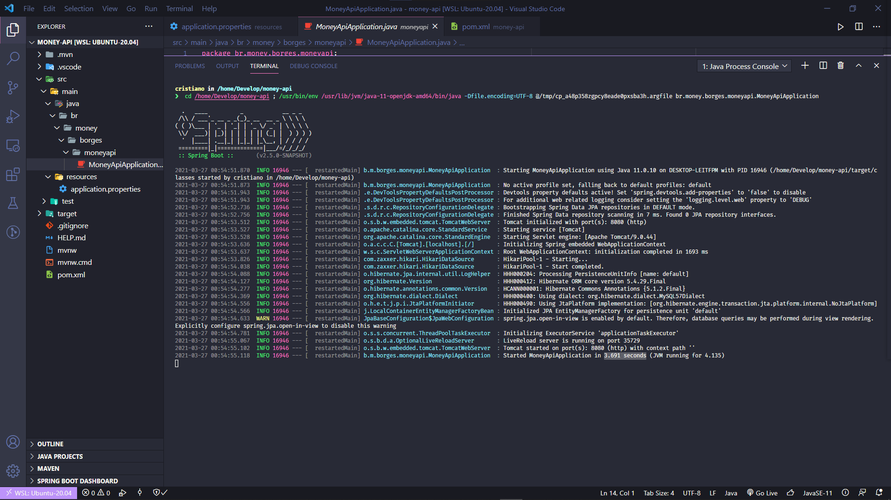

# Spring

Projeto sendo desenvolvido em JAVA, backend em Spring frontend Angular 9 e banco de dados MYSQL 

<h4 align="center">
 ⚡️ Desenvolvendo...
</h4>

## 💻 Sobre o projeto

# RESTful com Spring, MYSQL

> Projeto sendo desenvolvido para cadastro de usuarios e produtos, sistema contara com criacao de usuarios, atualiazacao de dados do usuario, cadastro de produtos e atualizacao e exclusao de produtos e usuarios.\*\*



API address in Spring

https://github.com/CristianoBV/API_Spring_Java

APPLICATION IN CRUD

## 🛠 Tecnologias

As seguintes ferramentas foram usadas na construção do projeto:

-
- [Angular][angular]
- [Spring][spring]
- [MYSQL][mysql]
- [JAVA][java]
- [Yarn][yarn]
- [Vscode][vscode]
- [Vceditconfig][vceditconfig]
- [Vceslint][vceslint]
- [License][license]

## ⚡️ Como executar o projeto

1. Front End (https://github.com/CristianoBV/Barbearia_Corte_Real)

### Pré-requisitos

Antes de começar, você vai precisar ter instalado em sua máquina as seguintes ferramentas:
[Git](https://git-scm.com), [JAVA][java], [MYSQL][mysql], [Spring][spring].
Além disto é bom ter um editor para trabalhar com o código como [VSCode][vscode]


## ⚡️ Como executar o projeto (Back End)

1. Back End (https://github.com/CristianoBV/API_Spring_Java)

```bash
# Clone este repositório
$ git clone https://github.com/CristianoBV/API_Spring_Java

# Vá para a pasta server
$ cd api

# Instale as dependências
$ dependencias instala, automaticamente, dependendo do seu editor [VSCode][vscode] enter no arquivo 
pom.xml e atualize.

# Execute a aplicação em modo de desenvolvimento
$ run main

```

Feito com ❤️ por cristiano Borges 👋🏽 [Entre em contato!](https://www.linkedin.com/in/cristianobv/)


[angular]: https://angular.io/
[spring]: https://spring.io/
[mysql]: https://www.mysql.com/
[java]: https://www.java.com/pt-BR/
[vscode]: https://code.visualstudio.com/
[vceditconfig]: https://marketplace.visualstudio.com/items?itemName=EditorConfig.EditorConfig
[license]: https://github.com/CristianoBV/privacy_policy
[vceslint]: https://marketplace.visualstudio.com/items?itemName=dbaeumer.vscode-eslint
